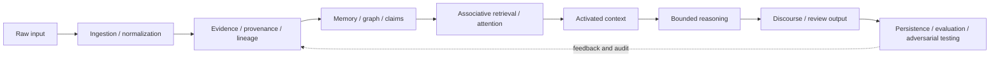

# Canonical flow

```mermaid
flowchart LR
    A[Raw input] --> B[Ingestion / normalization]
    B --> C[Evidence / provenance / lineage]
    C --> D[Memory / graph / claims]
    D --> E[Associative retrieval / attention]
    E --> F[Activated context]
    F --> G[Bounded reasoning]
    G --> H[Discourse / review output]
    H --> I[Persistence / evaluation / adversarial testing]
    I -. feedback and audit .-> C
```

The feedback path records and evaluates state; it does not turn repeated processing into independent confirmation.

